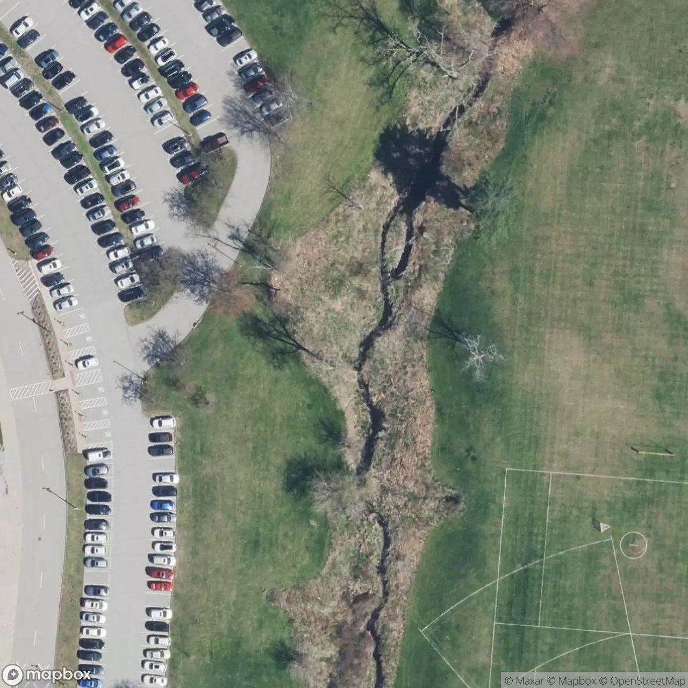
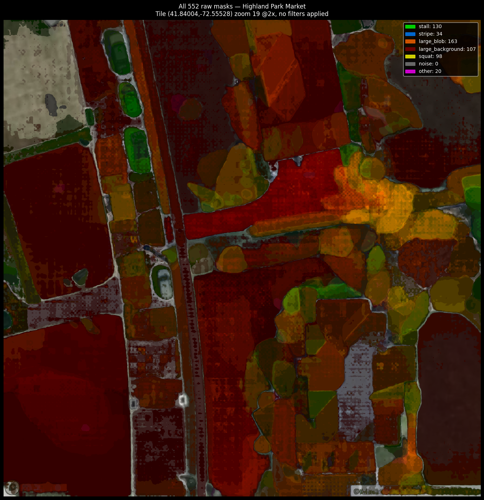
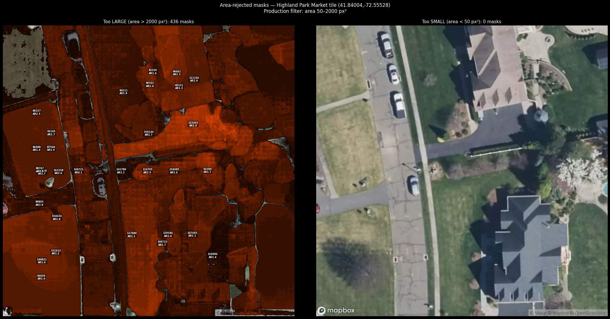

# Spottr

> **Project Status: Archived (May 2026)**
>
> Spottr was a solo summer project exploring real-time parking occupancy detection
> from satellite imagery. The CV pipeline, zone partitioning, and mobile state machine
> are all functional. The consumer app concept was archived after determining that live
> data acquisition costs ($250+/satellite capture, $3–15K/yr for connected-vehicle
> data) are structurally incompatible with consumer-app economics without enterprise
> partnerships. The engineering remains as documented infrastructure.

---

**Satellite AI that counts open parking spots before you leave home.**

Spottr uses computer vision on satellite imagery to detect and count individual
parking spaces in any surface lot — no sensors, no operator partnerships, no
crowdsourcing. Open the app, see exactly how many spaces are available in each
zone of your target lot, and navigate directly to the highest-availability zone.

---

## The Problem

Drivers spend an average of 17 minutes per trip searching for parking. Existing
solutions require either expensive per-lot sensor hardware (ParkWhiz, SpotHero)
or depend on crowdsourced data that goes stale immediately. Neither works for the
suburban surface lots where most Americans actually park.

## The Solution

Spottr runs YOLOv8 + SAM2 on satellite imagery to detect every striped parking
space in a lot, classify it as occupied or empty, and return zone-level open counts
via API — once per lot, refreshed when the imagery ages. No hardware. No operators.
No crowdsourcing.

```
Satellite tile → YOLOv8-OBB stripe detection → SAM2 space segmentation
→ occupied / open classification → zone counts → mobile app
```

At Costco South Windsor (a 640-space warehouse lot), Spottr detects all four zones
with sub-5% error against a manual ground-truth count.

---

## What's Built

| Layer | Status | Detail |
|-------|--------|--------|
| CV Pipeline | ✅ Live | YOLOv8-OBB + SAM2 on Modal GPU · ~36s per lot · 640 spaces detected at Costco |
| Lot Database | ✅ Live | Railway PostgreSQL · ~970 CT lots · OSM + building-inferred bbox geometry |
| Backend API | ✅ Live | Node.js/Express on Railway · Places name resolution · freshness state machine |
| Mobile App | ✅ Built | React Native (Expo 54) · iOS + Android · full parking navigation loop |
| AI Map | ✅ Built | Detected spots overlaid on CTECO 7.6 cm/px imagery (CT) or Mapbox z20 |
| Parking Flow | ✅ Built | GPS dwell detection · zone routing · Find My Car deeplink |

---

## In Action

### CV Pipeline — satellite → detected spaces

**Step 1 · Satellite tile input (z19, ~36 m ground coverage)**



*Highland Park Market, Manchester CT — z19 Mapbox/Maxar tile. Individual cars and painted stripes are visible at this zoom level. Up to 25 tiles (5×5 grid) are fetched per lot and stitched before running YOLOv8.*

---

**Step 2 · SAM2 segmentation — all raw masks**



*All segment classes returned by SAM2 before filtering: `mat` (asphalt), `stripe` (white lane markings), `large_bldg`, `small_background`, `noise`. ~436 raw segments at this tile. The colour-coded legend is printed to the debug image at inference time.*

---

**Step 3 · Area filter — rejecting non-parking segments**



*Left: masks rejected by area (too large > 2 000 px² = building/lot-wide, or too small < 50 px² = noise). Right: satellite tile with remaining candidate parking-space segments. Only segments passing both area bounds and class filter (`stripe` or `mat`) proceed to occupancy classification.*

---

### Mobile App

> Device screenshots will be added here after first TestFlight build.
> Screens: Home (map + lot list) · Search (Places autocomplete) · Lot Detail (AI Map + open count + zone rows) · Driving (dwell detection) · Parked (Find My Car)

---

## How It Works

### 1. Lot geometry
Each lot gets a bounding box from one of three strategies:

- **OSM union** (highest confidence) — union of all OSM parking ways within radius,
  verified against building footprint
- **Building-inferred** (warehouse format) — 220m symmetric buffer around building
  centroid, capped per lot type; calibrated for Costco / Sam's Club / BJ's geometry
- **Low OSM coverage** — flagged; falls back to radius buffer

### 2. Detection
`POST /api/lots/:id/detect` triggers the Modal serverless GPU function:

1. Fetch z19 Mapbox satellite tiles covering the bbox (up to 5×5 = 25 tiles)
2. YOLOv8-OBB detects parking stripe orientations across the tile grid
3. SAM2 segments individual spaces from stripe masks
4. Occupied/open classification from pixel intensity + stripe overlap
5. Spaces grouped into zones (A → D) by spatial clustering
6. Result cached with `last_spot_detection` timestamp; freshness state A/B/C/D
   computed from detection age

### 3. Freshness state machine

| State | Condition | Display |
|-------|-----------|---------|
| A | BestTime live + detection < 4h | Live · N min ago |
| B | Detection < 24h | Scanned N h ago |
| C | Detection 24–72h | Scanned N days ago |
| D | Detection > 72h or never | Capacity only |

### 4. Mobile navigation loop

```
Home (map + lot list)
  → Search (Places autocomplete)
  → Lot Detail (AI Map + open count + zone rows)
      → "Take me there" → external Maps + DrivingScreen
          → DrivingScreen (GPS dwell detection · 30s availability poll)
              → lot full → Reroute (alternate lot search)
              → dwell detected → Parked (Find My Car · Done)
```

---

## Stack

| Component | Technology |
|-----------|------------|
| CV pipeline | Python · YOLOv8-OBB · SAM2 · Modal (serverless GPU) |
| Backend | Node.js · Express · PostgreSQL · Redis (Railway) |
| Mobile | React Native · Expo SDK 54 · TypeScript |
| Maps | Mapbox satellite tiles · CTECO 2023 orthophoto (CT) · Apple/Google Maps deeplinks |
| State | Zustand 5 + AsyncStorage (parking flow only) |
| Places | Google Places API (New) v1 |

---

## Verified Lots

| Lot | Type | Spaces | Bbox | Source |
|-----|------|--------|------|--------|
| Costco South Windsor CT | warehouse_store | 640 | 606×605m | building_inferred |
| Sam's Club Newington CT | warehouse_store | 477 | 593×563m | building_inferred |
| Target Buckland Hills CT | commercial | 351 | 310×477m | osm_union |
| SWHS (high school) | institutional | 139 | 170×261m | osm_union |

---

## Why It Doesn't Ship

Spottr's per-stall CV detection produces accurate counts from any commercial satellite
tile. But satellite tiles served by Mapbox, Google, and similar providers are typically
6 months to 4 years old — they're stitched archives, not live feeds. This means Spottr
reports occupancy "as of when the tile was captured," not "right now."

Real-time satellite tasking exists (Planet SkySat, Maxar WorldView) but starts at $250
per capture for an area smaller than a single Costco lot, scaling to thousands per day
if you wanted hourly refresh. Connected-vehicle trip-end aggregation (INRIX, formerly
Wejo) offers real-time occupancy via anonymized phone GPS data but is sold via
$3–15K/year enterprise contracts.

The closest accessible live signal is Google Maps Popular Times (foot traffic at the
anchor business). But that signal is the same data Google shows in its own app, which
removes any consumer-app wedge against just opening Google Maps directly.

Spottr remains a working demonstration of:
- End-to-end CV pipeline (YOLO + SAM2) on satellite tiles
- Zone-level spatial reasoning about parking lots
- Multi-source geometry pipeline with provenance tracking
- Mobile state machine with background location triggers

These components are the interesting work. The product they're embedded in is not.

---

## What I Learned

- **OSM data quality varies wildly.** About 60% of US parking lots have no
  `amenity=parking` polygon at all. Building a bbox provenance system
  (`osm_union` → `building_inferred` → `low_osm_coverage`) became more important
  than any CV improvement.

- **SAM2 segmentation is real but the area-filter step does more work than the model.**
  Rejecting too-large/too-small segments by pixel area eliminates buildings, road
  surfaces, and noise more reliably than the class labels. Pure ML rarely beats simple
  geometric post-processing for production accuracy.

- **Modal serverless GPU is the right primitive for one-shot CV jobs.** Cold start
  ~60–120s, warm latency ~3s. Cheaper than always-on for sporadic detection traffic.
  The `min_containers=0` setting is essential for dev economics.

- **Live data is the bottleneck for every location app.** The solutions are: own the
  lots (Premier Parking), license enterprise data (INRIX), or scrape the incumbent
  (Outscraper for Google Popular Times). The third option puts you structurally below
  the incumbent.

- **Connecticut publishes free 7.6 cm/pixel aerial imagery via CT ECO.** Most states
  have similar open imagery programs that are 5–10× sharper than commercial satellite
  providers and completely unmarketed.

- **Scope creep is the real failure mode.** Four rounds of bug fixes after Gate C
  shipped, each one adding 30 minutes that turned into 90. Hard scope gates with
  explicit "do not touch" lists were the only thing that kept the build moving.

---

## Running Locally

> **Note:** The hosted backend at `spottr-api-production.up.railway.app` was
> decommissioned in May 2026. To run locally you'll need your own API keys for
> Modal, Mapbox, and Google Places (see `backend/.env.example`) and to deploy
> the backend yourself. Frozen sample API responses are in `demo/api-responses/`.

### Backend
```bash
cd backend
npm install
# Set DATABASE_URL, GOOGLE_PLACES_KEY, MODAL_TOKEN_ID, MODAL_TOKEN_SECRET in .env
npm run dev          # http://localhost:8080
```

### Mobile
```bash
cd mobile
npm install
# Set EXPO_PUBLIC_API_URL, EXPO_PUBLIC_GOOGLE_MAPS_KEY in mobile/.env
npx expo start       # scan QR with Expo Go
```

### Trigger a detection
```bash
# Via Railway (uses internal DATABASE_URL)
railway run node backend/scripts/detect_lot.js <lot_id>
```

---

## API

Base URL: `https://spottr-api-production.up.railway.app`

| Endpoint | Description |
|----------|-------------|
| `GET /api/lots/near?lat=&lng=&radius=` | Lots near a coordinate with freshness |
| `GET /api/lots/:id` | Lot detail with freshness label |
| `GET /api/lots/:id/rows` | Zone rows with open/total counts and centroids |
| `GET /api/search?q=` | Places autocomplete (Google Places New API) |
| `GET /health` | DB status |

---

## Repository Layout

```
spottr/
├── backend/
│   ├── modal/detect.py          YOLOv8-OBB + SAM2 GPU function
│   ├── src/
│   │   ├── api/lots.js          Core lot API + bbox geometry + name resolution
│   │   ├── api/search.js        Places autocomplete proxy
│   │   └── services/freshness.js Freshness state machine
│   └── scripts/                 One-time backfill + diagnostic scripts
└── mobile/
    ├── src/
    │   ├── screens/             Home · Search · LotDetail · Driving · Reroute · Parked
    │   ├── components/          LotCard · BigNumberCount · ZoneThumbnail · ConfidencePill · …
    │   └── services/
    │       ├── api.ts           Typed API client
    │       └── parkingStateMachine.ts  Zustand store · GPS watcher · dwell detection
    └── App.tsx                  Navigation stack
```

---

## Roadmap

> All V6+ items below are **documented but not pursued**. The project is archived.
> Full design notes for each item are in `CLAUDE.md`.

**V6 — Static geometry × live busyness** *(documented, not pursued)*
Multiply satellite space count (static denominator) by BestTime.app busyness index
(live numerator) → probabilistic real-time availability without fresh imagery.
`open_spaces ≈ total_spaces × (1 − busyness_index)` ± 15%.

**V6.5 — Direct measurement partners** *(documented, not pursued)*
TomTom / Parkopedia direct occupancy data as override where available.
Commercial inquiry sent to Parkopedia 2026-05-18. TomTom closed (automotive-only
enterprise tier). Parkopedia response pending at archive time.

**V7 — Spot-level live occupancy** *(documented, not pursued)*
Connected-vehicle telemetry (Wejo / INRIX) spatial-joined to SAM2 stall polygons.
Per-stall open/occupied → tap to navigate to specific coordinate. Requires
$50K–$250K/year data contracts or owned-sensor deployment at flagship lots.

---

## License

Private — all rights reserved.
