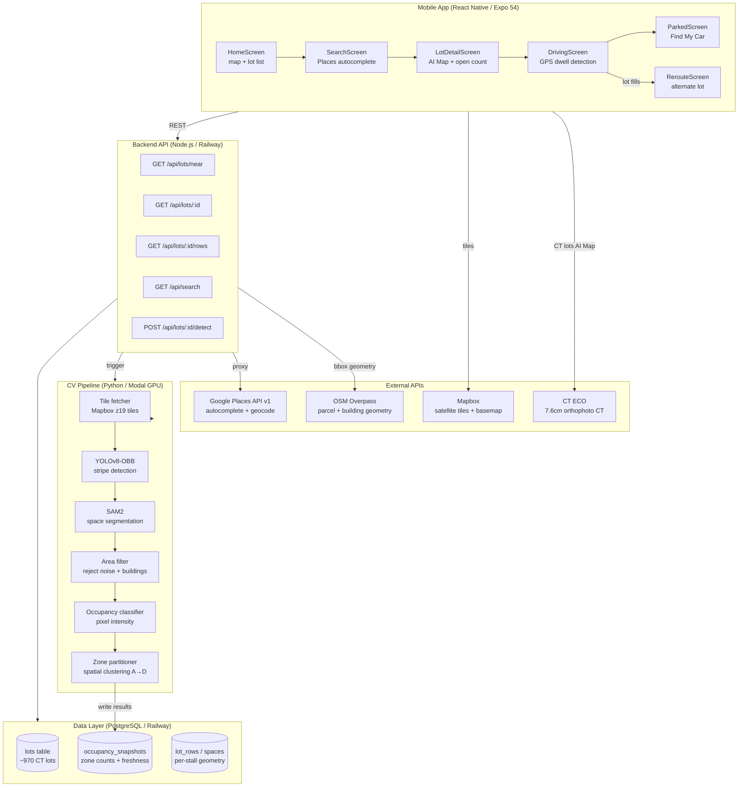

# Spottr — Data Flow Architecture

Rendered with Mermaid. Paste into https://mermaid.live to view as a diagram.

## Key design decisions encoded in this diagram

1. **Modal is triggered on-demand**, not on a schedule. `POST /api/lots/:id/detect`
   is called by the backend when a lot's freshness state falls to C or D. The mobile
   app never calls Modal directly.

2. **CTECO vs Mapbox tile split**: CT lots get the 7.6 cm/px CTECO orthophoto as the
   AI Map base layer. Non-CT lots fall back to Mapbox z20 satellite tiles. Both
   overlays share the same detected-spot circle layer.

3. **Freshness state machine** (A→B→C→D) is computed in `freshness.js` at query time,
   not stored. It depends on `last_spot_detection` age and BestTime live availability.

4. **OSM Overpass** is called once at lot hydration time (not per request) to derive
   bbox geometry via building footprint + parking way union. Results are stored in
   `lots.bbox_*` columns with a `bbox_source` provenance tag.
