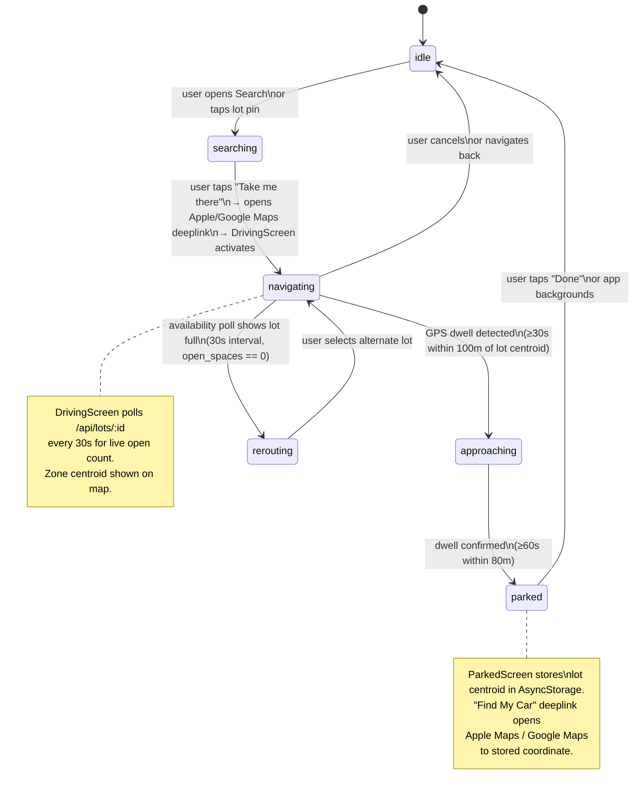
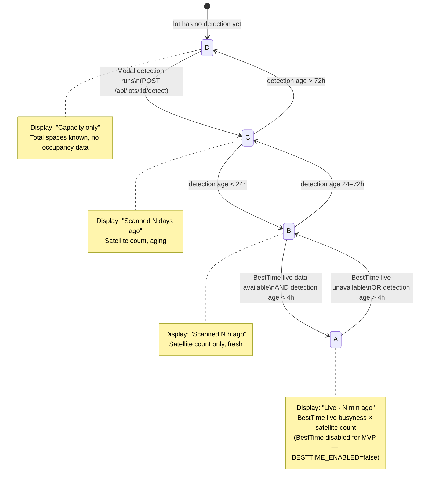
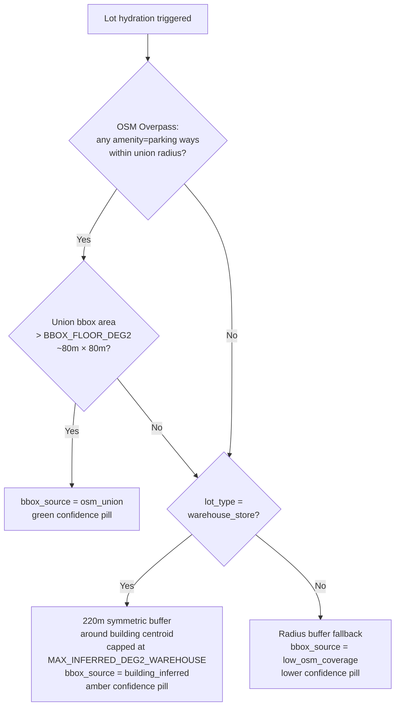

# Spottr — State Machines

Rendered with Mermaid. Paste into https://mermaid.live to view as diagrams.

---

## 1. Parking Navigation State Machine (mobile)

Lives in `mobile/src/services/parkingStateMachine.ts` (Zustand store).

---

## 2. Lot Freshness State Machine (backend)

Lives in `backend/src/services/freshness.js`. Computed at query time from
`last_spot_detection` age and BestTime availability. Never stored — derived fresh
each API call.

---

## 3. Bbox Provenance Decision Tree (backend)

Lives in `backend/src/api/lots.js`. Runs at lot hydration time via OSM Overpass.

